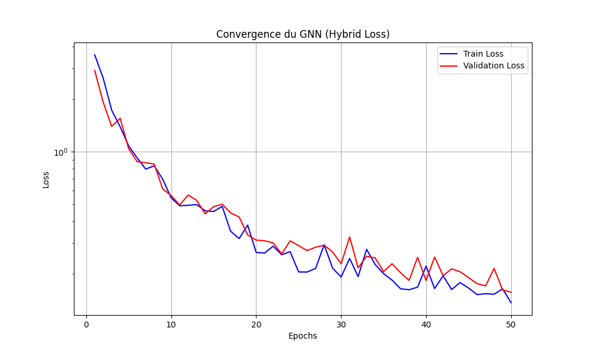

# Airfoil CFD Simulator : GNN & PINN Hybrid approach

Ce projet présente un simulateur aérodynamique intelligent capable de prédire les champs de pression et de vitesse autour de profils d'ailes NACA 4-chiffres. Il utilise une architecture hybride combinant les **Graph Neural Networks (GNN)** et les principes des **Physics-Informed Neural Networks (PINN)** pour servir de modèle de substitution (*Surrogate Model*) temps réel.

## 🚀 Points Clés & Performance
- **Accélération Massive** : Prédiction en **~15ms** (vs ~120s pour OpenFOAM), soit un gain de vitesse de **x8000**.
- **Dataset Robuste** : Entraîné et validé sur **500 simulations RANS** générées automatiquement, couvrant une large variété de géométries NACA.
- **Haute Précision** : Erreur moyenne relative **< 2%** sur les champs de vitesse et de pression par rapport au solveur physique de référence.
- **Architecture Avancée** :
    - Graph Network basé sur **MeshGraphNet** (4 couches de message passing, 128 unités cachées).
    - **Smart Density Sampling** : Échantillonnage adaptatif (100% des points en couche limite, 10% en champ lointain) pour capturer la physique critique sans compromis.
    - **Hybrid Loss (PINN)** : La fonction de coût intègre des contraintes physiques (Conditions aux limites, No-Slip sur le mur, Équations de conservation).

## 📁 Structure du Projet
- `src/` : Code source complet (Génération de données, entraînement, validation).
- `data/` : Données de simulation et résultats.
- `airfoil_gnn_best.pt` : Poids du modèle entraîné (Version V5 ).
- `normalizer_stats.pt` : Statistiques de normalisation pour l'inférence.

## 🛠️ Installation & Utilisation
1. **Pré-requis** : PyTorch, PyTorch Geometric, PyVista, Scikit-Learn, OpenFOAM.
2. **Génération Dataset** : `python src/generate_dataset.py`
3. **Création des Graphes** : `python src/extract_to_graphs.py`
4. **Entraînement** : `python src/train.py`
5. **Validation** : `python src/validate_gnn_vs_openfoam.py`

## 📊 Résultats
Le modèle a été validé par rapport à des simulations OpenFOAM (SimpleFoam) avec un écart < 2% et des données théoriques XFOIL.

### Courbe de Convergence

### Comparaison des Champs de Vitesse

## 🧠 Méthodologie
1. **Génération** : Création automatique de maillages Gmsh et exécution de simulations OpenFOAM en parallèle.
2. **Graph Construction** : Conversion des maillages en graphes KNN (K-Nearest Neighbors) avec attributs géométriques relatifs.
3. **Entraînement** : Utilisation du scheduler `OneCycleLR` pour une convergence rapide et stable.

---
*Projet Personel réalisé dans le cadre d'une recherche sur l'accélération de la conception aéronautique par l'IA.*
