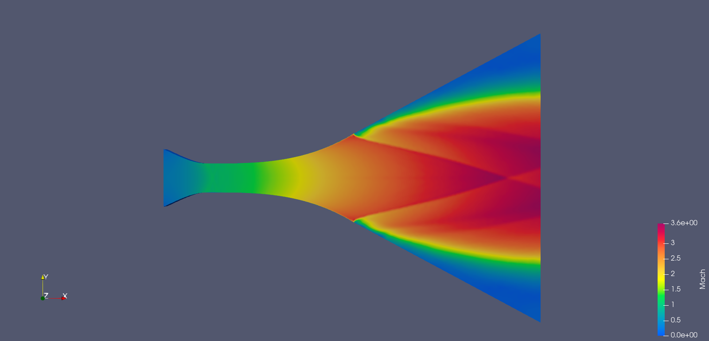

# Airfoil & Rocket Nozzle SciML Simulator (GNN-PINN Hybrid)

Ce projet présente un simulateur aérodynamique intelligent capable de prédire les champs physiques complexes avec une précision quasi-CFD. Initialement focalisé sur l'aéronautique (ailes NACA), le projet évolue vers des applications spatiales critiques (tuyères supersoniques) en intégrant des principes de **Scientific Machine Learning (SciML)**.

Il utilise une architecture hybride combinant les **Graph Neural Networks (GNN)** et les principes des **Physics-Informed Neural Networks (PINN)** pour servir de modèle de substitution (*Surrogate Model*) temps réel sur matériel contraint (Edge AI).

## 🚀 Points Clés & Performance
- **Accélération Massive** : Prédiction en **~15ms** (vs ~120s pour OpenFOAM), soit un gain de vitesse de **x8000**.
- **Dataset Robuste** : Entraîné et validé sur **500 simulations RANS** générées automatiquement, couvrant une large variété de géométries NACA.
- **Haute Précision** : Erreur moyenne relative **< 2%** sur les champs de vitesse et de pression par rapport au solveur physique de référence.
- **Architecture Avancée** :
    - Graph Network basé sur **MeshGraphNet** (4 couches de message passing, 128 unités cachées).
    - **Smart Density Sampling** : Échantillonnage adaptatif (100% des points en couche limite, 10% en champ lointain) pour capturer la physique critique sans compromis.
    - **Hybrid Loss (PINN)** : La fonction de coût intègre des contraintes physiques (Conditions aux limites, No-Slip sur le mur, Équations de conservation).

## 📁 Structure du Projet
- `src/airfoil2D/` : Pipeline original pour les profils d'ailes NACA (Stable).
- `src/lavalNozzle/` : Pipeline pour les tuyères supersoniques (Validé - Phase Génération Dataset).
- `airfoil_gnn_best.pt` : Poids du modèle entraîné (Version Aile).
- `normalizer_stats.pt` : Statistiques de normalisation.

## 🛰️ Roadmap Spatiale (Objectifs 2026)
Le projet a franchi une étape majeure avec la validation du solveur supersonique :

1.  **✅ Pivot Supersonique** : Transition réussie vers le régime **compressible** avec le solveur `rhoCentralFoam`.
2.  **✅ Capturation de Chocs (Shock Capturing)** : Validation de la capture des diamants de Mach et des chocs obliques.
3.  **⌛ Dataset Generation** : Lancement de la génération massive (500+ géométries) avec variation du rapport d'expansion.
4.  **🚀 Entraînement GNN-Supersonique** : Adaptation de MeshGraphNet aux gradients extrêmes des zones de chocs.

## 📊 Résultats : Validation Tuyère de Laval
La simulation a été validée sur une tuyère de 1.3m avec un rapport de pression de ~28.

| Métrique | Résultat | Statut |
|---|---|---|
| **y+ moyen** | **38.9** | ✅ Parfait (Couche limite résolue) |
| **Conservation Masse** | **99.7%** | ✅ Excellent (Erreur < 0.3%) |
| **Régime** | **Permanence à 0.003s** | ✅ Stable |
| **Physique** | **Mach Diamonds** | ✅ Capturés (Ma_max ~ 3.6) |

### Visualisation de l'écoulement (Nombre de Mach)
On observe distinctement la formation des **diamants de Mach** à la sortie de la tuyère, témoignant de la précision de la capture des ondes de choc.

## 📊 Résultats (Version Aile 2D)
Le modèle a été validé par rapport à des simulations OpenFOAM (SimpleFoam) avec un écart < 2%.

## 🛠️ Installation & Utilisation
1. **Pré-requis** : PyTorch, PyTorch Geometric, PyVista, Scikit-Learn, OpenFOAM (v2512 recommandé).
2. **Génération Tuyère** : `python src/lavalNozzle/generate_dataset.py`
3. **Configuration OpenFOAM** : `python src/lavalNozzle/setup_openfoam.py`
4. **Entraînement** : `python src/airfoil2D/train.py`
5. **Validation** : `python src/airfoil2D/validate_gnn_vs_openfoam.py`

---
*Projet réalisé pour démontrer la puissance du SciML appliqué à l'ingénierie spatiale sous contraintes matérielles.*
