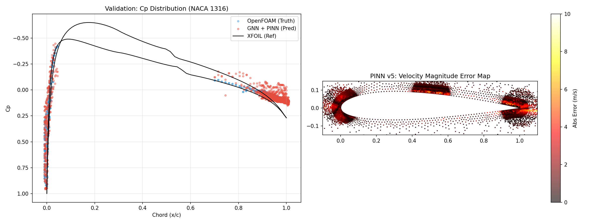
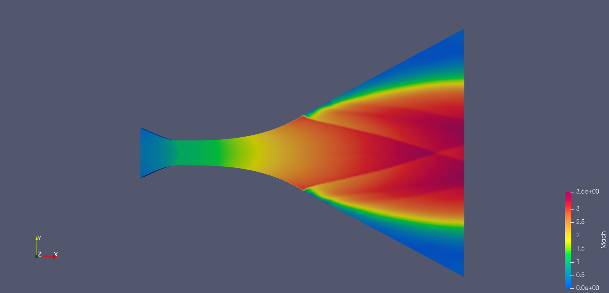

# Airfoil & Rocket Nozzle SciML Simulator (GNN-PINN Hybrid)

Ce projet présente un simulateur aérodynamique intelligent capable de prédire les champs physiques complexes avec une précision quasi-CFD. Initialement focalisé sur l'aéronautique (ailes NACA), le projet évolue vers des applications spatiales critiques (tuyères supersoniques) en intégrant des principes de **Scientific Machine Learning (SciML)**.

Il utilise une architecture hybride combinant les **Graph Neural Networks (GNN)** et les **Physics-Informed Neural Networks (PINN)** pour servir de modèle de substitution (*Surrogate Model*) temps réel.

## 🚀 Points Clés & Performance

### GNN (MeshGraphNet)
- **Accélération Massive** : Prédiction en **~15ms** (vs ~120s pour OpenFOAM), soit un gain de vitesse de **x8000**.
- **Dataset Robuste** : Entraîné et validé sur **500 simulations RANS** générées automatiquement, couvrant une large variété de géométries NACA.
- **Haute Précision** : Erreur moyenne relative **< 2%** sur les champs de vitesse et de pression par rapport au solveur physique de référence.

### PINN Paramétrique (Nouveau ✨)
- **Zéro donnée supervisée** : Le modèle apprend uniquement à partir des équations de Navier-Stokes et des conditions aux limites, sans aucun dataset CFD.
- **Paramétrique** : Un seul modèle couvre une plage continue d'angles d'attaque ($\alpha \in [-10°, 15°]$).
- **Validation quantitative** : Comparaison systématique contre OpenFOAM (simpleFoam) sur les champs $(u, v, p)$ et les coefficients aérodynamiques ($C_l$, $C_d$).

## 🧠 Architecture PINN

Le PINN paramétrique utilise une architecture avancée conçue pour résoudre les défis spécifiques de la prédiction d'écoulements autour de profils d'ailes :

| Composant | Détails |
|---|---|
| **Embedding** | Fourier Feature Embedding  |
| **Conditionnement** | FiLM (Feature-wise Linear Modulation) — sépare le réseau spatial et paramétrique |
| **Architecture** | Local Net (spatial) + Global Net (paramétrique $\alpha$) → 128 neurones cachés |
| **Optimisation** | Hybride : AdamW (1500 epochs, exploration) → L-BFGS (250 epochs, raffinement multi-angles) |
| **Physique** | Navier-Stokes 2D incompressible laminaire ($Re = 30$) |

### Stratégie d'entraînement
1. **Phase 1 — AdamW** : Exploration stochastique avec CosineAnnealing LR et gradient clipping.
2. **Phase 2 — L-BFGS** : Fine-tuning simultané sur 20 angles d'attaque avec données fixes. Convergence monotone vers la solution physique.

## 📊 Résultats PINN — Validation Multi-Angles

Le modèle PINN a été validé contre des simulations OpenFOAM (simpleFoam, laminaire) sur un profil **NACA 2412** à $Re = 30$ pour trois angles d'attaque :

### Erreurs Relatives L2 sur les Champs

| Champ | $\alpha = 0°$ | $\alpha = 8°$ | $\alpha = -4°$ |
|---|---|---|---|
| **Vitesse $u$** | **1.23%** | **1.72%** | **1.56%** |
| **Vitesse $v$** | **8.36%** | **7.36%** | **9.02%** |
| **Pression $p$** | **11.29%** | **15.74%** | **13.43%** |

### Coefficients Aérodynamiques

| Coefficient | $\alpha = 0°$ | $\alpha = 8°$ | $\alpha = -4°$ |
|---|---|---|---|
| **$C_d$ (Traînée)** | CFD: 1.137 vs PINN: 1.127 (**0.8%**) | CFD: 1.200 vs PINN: 1.171 (**2.4%**) | CFD: 1.150 vs PINN: 1.133 (**1.5%**) |
| **$C_l$ (Portance)** | CFD: 0.047 vs PINN: 0.052 (**10.1%**) | CFD: 0.687 vs PINN: 0.442 (**35.6%**) | CFD: -0.276 vs PINN: -0.126 (**54.4%**) |

### Comparaisons Visuelles (PINN vs CFD)

**$\alpha = 0°$** — Erreur $u$ : 1.23%, $C_d$ Error: 0.8%

**$\alpha = 8°$** — Erreur $u$ : 1.72%, $C_d$ Error: 2.4%

**$\alpha = -4°$** — Erreur $u$ : 1.56%, $C_d$ Error: 1.5%

### Convergence de l'entraînement

## 📊 Résultats GNN (Version Aile 2D)
Le modèle GNN a été validé par rapport à des simulations OpenFOAM (SimpleFoam) avec un écart < 2%.

## 🛰️ Résultats : Validation Tuyère de Laval
La simulation a été validée sur une tuyère de 1.3m avec un rapport de pression de ~28.

| Métrique | Résultat | Statut |
|---|---|---|
| **Modèle** | **Laminaire (Euler-like)** | ✅ Robuste |
| **Conservation Masse** | **~99%** | ✅ Excellent |
| **Régime** | **Permanence à 0.006s** | ✅ Stable |
| **Physique** | **Mach Diamonds** | ✅ Capturés (Ma_max ~ 3.6) |
| **Maillage** | **Adaptatif (Slip Wall)** | ✅ Élimine volumes négatifs |

## 📁 Structure du Projet
- `src/airfoil2D/` : Pipeline PINN paramétrique + GNN pour les profils d'ailes NACA.
- `src/lavalNozzle/` : Pipeline pour les tuyères supersoniques.
- `airfoil_gnn_best.pt` : Poids du modèle GNN entraîné.
- `pinn_airfoil_model_V2.pth` : Poids du modèle PINN paramétrique.

## 🖥️ Application Interactive (Streamlit)

Une application Streamlit est disponible pour tester le PINN paramétrique en temps réel. Elle permet de :
- Faire varier l'angle d'attaque ($\alpha$) via un slider.
- Visualiser instantanément les champs de vitesse ($u, v$) et de pression ($p$).
- Obtenir les coefficients de portance ($C_l$) et de traînée ($C_d$).
- Un gain de performance significatif : **~5s (PINN)** vs **~380s (OpenFOAM)** pour une simulation complète.

## 🛠️ Installation & Utilisation
1. **Pré-requis** : PyTorch, PyTorch Geometric, PyVista, Scikit-Learn, OpenFOAM (v2512 recommandé).
2. **Entraînement PINN** : `python src/airfoil2D/PINN_Airfoil.py -t`
3. **Validation PINN vs CFD** : `python src/airfoil2D/PINN_Airfoil.py -c pinn_airfoil_model_V2.pth`
4. **Génération Tuyère** : `python src/lavalNozzle/generate_dataset.py`
5. **Entraînement GNN** : `python src/airfoil2D/train.py`

## 🗺️ Roadmap (2026)

1. ✅ PINN Paramétrique validé multi-angles
2. ✅ Déploiement Streamlit pour démo interactive
3. ⌛ PINN Paramétrique Aile NACA (Généralisation)
4. ⌛ Entraînement GNN-Supersonique

---
*Projet réalisé pour démontrer la puissance du SciML appliqué à l'ingénierie aérospatiale.*
