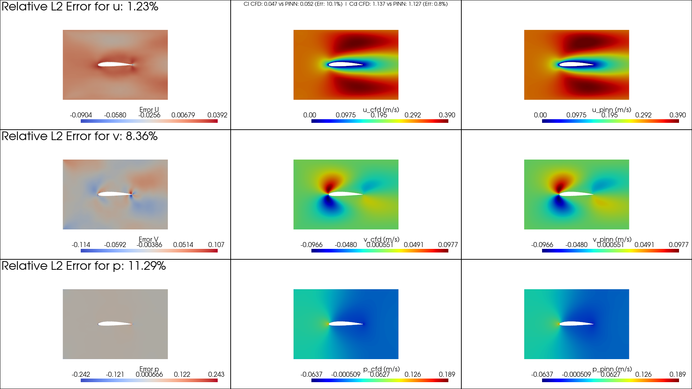
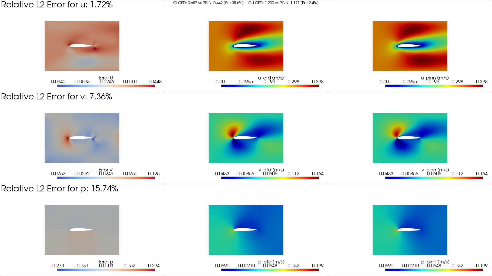
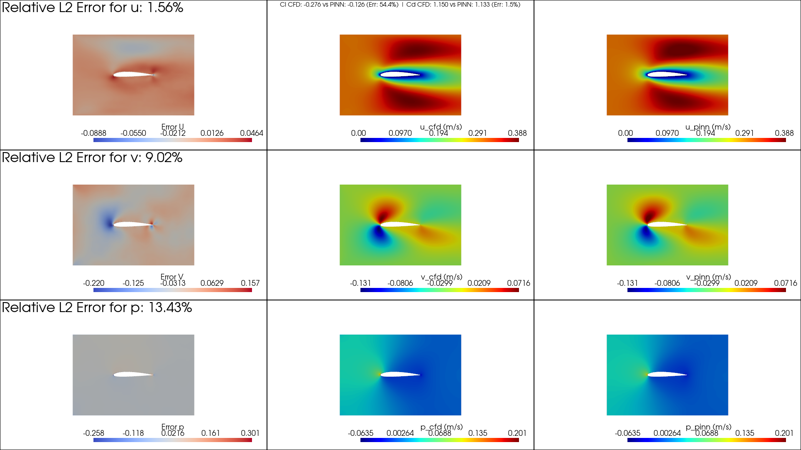
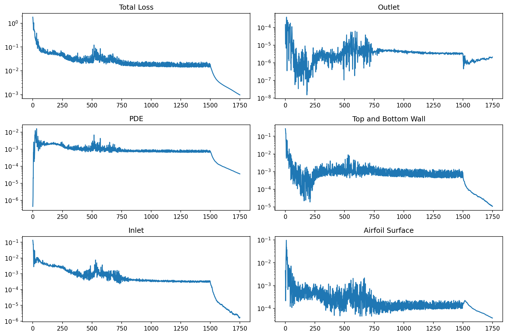

# Airfoil & Rocket Nozzle SciML Simulator (GNN-PINN Hybrid)

> 🇫🇷 Version française ci-dessous · 🇬🇧 English version below

---

## 🇬🇧 English Version

This project presents an intelligent aerodynamic simulator capable of predicting complex physical fields with near-CFD accuracy. Initially focused on aeronautics (NACA airfoils), it is evolving towards critical space applications (supersonic nozzles) by integrating **Scientific Machine Learning (SciML)** principles.

It uses a hybrid architecture combining **Graph Neural Networks (GNN)** and **Physics-Informed Neural Networks (PINN)** to serve as a real-time surrogate model.

### 🚀 Key Highlights & Performance

#### GNN (MeshGraphNet)
- **Massive Speedup**: Prediction in **~15ms** (vs ~120s for OpenFOAM), a **x8000** speed gain.
- **Robust Dataset**: Trained and validated on **500 automatically generated RANS simulations** covering a wide variety of NACA geometries.
- **High Accuracy**: Average relative error **< 2%** on velocity and pressure fields vs the reference physics solver.

#### PINN Parametric (New ✨)
- **Zero supervised data**: The model learns solely from Navier-Stokes equations and boundary conditions — no CFD dataset needed.
- **Parametric**: A single model covers a continuous range of angles of attack ($\alpha \in [-10°, 15°]$).
- **Quantitative validation**: Systematic comparison against OpenFOAM (simpleFoam) on $(u, v, p)$ fields and aerodynamic coefficients ($C_l$, $C_d$).
- **Speed**: ~5s (PINN) vs ~380s (OpenFOAM) for a full simulation.

### 🧠 PINN Architecture

| Component | Details |
|---|---|
| **Embedding** | Fourier Feature Embedding |
| **Conditioning** | FiLM (Feature-wise Linear Modulation) — separates spatial and parametric networks |
| **Architecture** | Local Net (spatial) + Global Net (parametric $\alpha$) → 128 hidden neurons |
| **Optimization** | Hybrid: AdamW (1500 epochs) → L-BFGS (250 epochs, multi-angle refinement) |
| **Physics** | 2D incompressible laminar Navier-Stokes ($Re = 30$) |

### 📊 PINN Results — Multi-Angle Validation

| Field | $\alpha = 0°$ | $\alpha = 8°$ | $\alpha = -4°$ |
|---|---|---|---|
| **Velocity $u$** | **1.23%** | **1.72%** | **1.56%** |
| **Velocity $v$** | **8.36%** | **7.36%** | **9.02%** |
| **Pressure $p$** | **11.29%** | **15.74%** | **13.43%** |

| Coefficient | $\alpha = 0°$ | $\alpha = 8°$ | $\alpha = -4°$ |
|---|---|---|---|
| **$C_d$ (Drag)** | CFD: 1.137 vs PINN: 1.127 (**0.8%**) | CFD: 1.200 vs PINN: 1.171 (**2.4%**) | CFD: 1.150 vs PINN: 1.133 (**1.5%**) |
| **$C_l$ (Lift)** | CFD: 0.047 vs PINN: 0.052 (**10.1%**) | CFD: 0.687 vs PINN: 0.442 (**35.6%**) | CFD: -0.276 vs PINN: -0.126 (**54.4%**) |

**$\alpha = 0°$** — $u$ error: 1.23%, $C_d$ error: 0.8%


**$\alpha = 8°$** — $u$ error: 1.72%, $C_d$ error: 2.4%


**$\alpha = -4°$** — $u$ error: 1.56%, $C_d$ error: 1.5%


Training convergence:


### �️ Interactive Streamlit App

A Streamlit application lets you test the parametric PINN in real time:
- Adjust the angle of attack ($\alpha$) via a slider
- Instantly visualize velocity ($u, v$) and pressure ($p$) fields
- Get lift ($C_l$) and drag ($C_d$) coefficients

**Run locally:**

```bash
# 1. Clone the repo
git clone https://github.com/Flumyne/airfoil-cfd-simulator-gnn-pinn-hybrid-approach.git
cd airfoil-cfd-simulator-gnn-pinn-hybrid-approach

# 2. Install dependencies (Python 3.12 recommended)
pip install -r requirements.txt

# 3. Launch the Streamlit app
python -m streamlit run src/app/Hello.py
```

> **Note:** A CUDA-compatible GPU is highly recommended for fast inference. The app will fall back to CPU if unavailable.

### �️ Installation & Usage

1. **Prerequisites**: PyTorch, Shapely, Matplotlib, Streamlit, OpenFOAM (v2512 recommended for CFD reference).
2. **Train PINN**: `python src/airfoil2D/PINN_Airfoil.py -t`
3. **Validate PINN vs CFD**: `python src/airfoil2D/PINN_Airfoil.py -c pinn_airfoil_model_V2.pth`
4. **Generate Nozzle dataset**: `python src/lavalNozzle/generate_dataset.py`
5. **Train GNN**: `python src/airfoil2D/train.py`

### 🗺️ Roadmap (2026)
1. ✅ Validated multi-angle parametric PINN
2. ✅ Streamlit interactive demo
3. ⌛ Generalized PINN for multi-geometry NACA
4. ⌛ GNN for supersonic nozzle

---

## 🇫🇷 Version Française

Ce projet présente un simulateur aérodynamique intelligent capable de prédire les champs physiques complexes avec une précision quasi-CFD. Il utilise une architecture hybride combinant les **Graph Neural Networks (GNN)** et les **Physics-Informed Neural Networks (PINN)** pour servir de modèle de substitution (*Surrogate Model*) temps réel.

### 🚀 Points Clés & Performance

#### GNN (MeshGraphNet)
- **Accélération Massive** : Prédiction en **~15ms** (vs ~120s pour OpenFOAM), soit un gain de **x8000**.
- **Dataset Robuste** : Entraîné sur **500 simulations RANS** générées automatiquement.
- **Haute Précision** : Erreur moyenne relative **< 2%** sur les champs de vitesse et de pression.

#### PINN Paramétrique (Nouveau ✨)
- **Zéro donnée supervisée** : Apprentissage uniquement à partir des équations de Navier-Stokes.
- **Paramétrique** : Un seul modèle couvre $\alpha \in [-10°, 15°]$.
- **Validation quantitative** : Comparaison systématique contre OpenFOAM.
- **Vitesse** : ~5s (PINN) vs ~380s (OpenFOAM).

### 🧠 Architecture PINN

| Composant | Détails |
|---|---|
| **Embedding** | Fourier Feature Embedding |
| **Conditionnement** | FiLM (Feature-wise Linear Modulation) |
| **Architecture** | Local Net (spatial) + Global Net (paramétrique $\alpha$) → 128 neurones |
| **Optimisation** | Hybride : AdamW (1500 epochs) → L-BFGS (250 epochs) |
| **Physique** | Navier-Stokes 2D incompressible laminaire ($Re = 30$) |

### 📊 Résultats PINN

| Champ | $\alpha = 0°$ | $\alpha = 8°$ | $\alpha = -4°$ |
|---|---|---|---|
| **Vitesse $u$** | **1.23%** | **1.72%** | **1.56%** |
| **Vitesse $v$** | **8.36%** | **7.36%** | **9.02%** |
| **Pression $p$** | **11.29%** | **15.74%** | **13.43%** |

### 🖥️ Application Interactive (Streamlit)

Une application Streamlit permet de tester le PINN paramétrique en temps réel.

**Lancement en local :**

```bash
# 1. Cloner le dépôt
git clone https://github.com/Flumyne/airfoil-cfd-simulator-gnn-pinn-hybrid-approach.git
cd airfoil-cfd-simulator-gnn-pinn-hybrid-approach

# 2. Installer les dépendances (Python 3.12 recommandé)
pip install -r requirements.txt

# 3. Lancer l'application Streamlit
python -m streamlit run src/app/Hello.py
```

> **Note :** Un GPU compatible CUDA est fortement recommandé pour une inférence rapide. L'application basculera sur le CPU si indisponible.

### 🛠️ Installation & Utilisation

1. **Pré-requis** : PyTorch, Shapely, Matplotlib, Streamlit, OpenFOAM (v2512 recommandé).
2. **Entraînement PINN** : `python src/airfoil2D/PINN_Airfoil.py -t`
3. **Validation PINN vs CFD** : `python src/airfoil2D/PINN_Airfoil.py -c pinn_airfoil_model_V2.pth`
4. **Génération Tuyère** : `python src/lavalNozzle/generate_dataset.py`
5. **Entraînement GNN** : `python src/airfoil2D/train.py`

### 📁 Structure du Projet
- `src/airfoil2D/` : Pipeline PINN paramétrique + GNN pour les profils d'ailes NACA.
- `src/lavalNozzle/` : Pipeline pour les tuyères supersoniques.
- `src/app/` : Application Streamlit interactive.
- `pinn_airfoil_model_V2.pth` : Poids du modèle PINN paramétrique entraîné.
- `airfoil_gnn_best.pt` : Poids du modèle GNN entraîné.

### 🗺️ Roadmap (2026)
1. ✅ PINN Paramétrique validé multi-angles
2. ✅ Déploiement Streamlit pour démo interactive
3. ⌛ PINN Paramétrique Aile NACA (Généralisation multi-géométries)
4. ⌛ Entraînement GNN-Supersonique

---
*Projet réalisé pour démontrer la puissance du SciML appliqué à l'ingénierie aérospatiale.*
